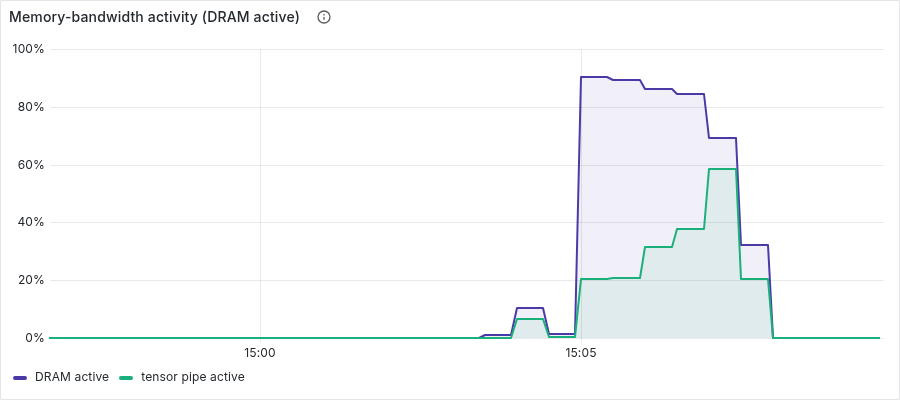
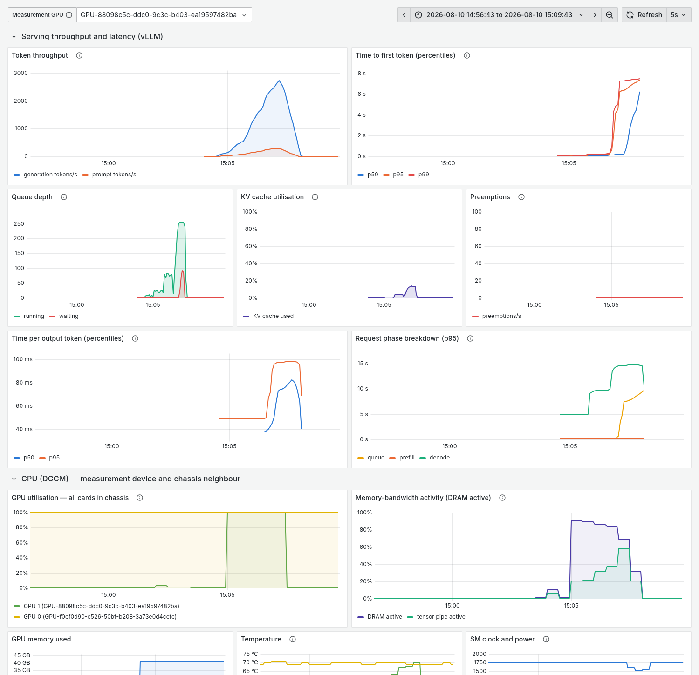
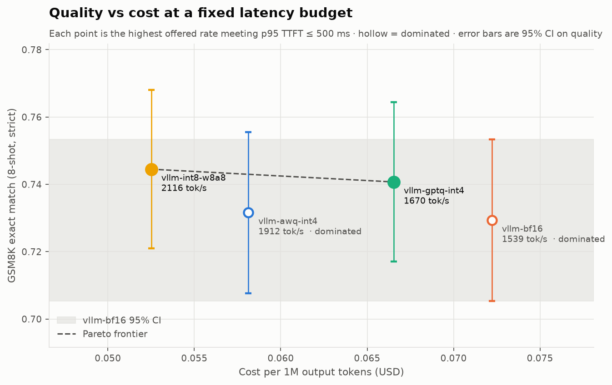
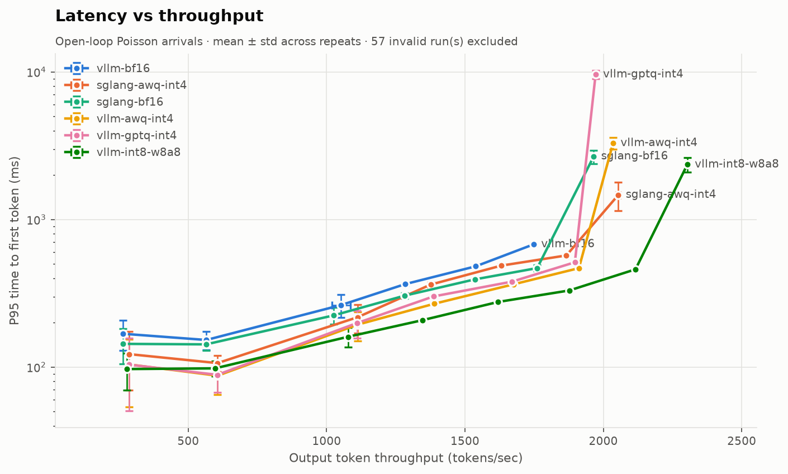

# LLM Inference Optimization — Quantization on an NVIDIA A40

> Latency-vs-throughput curves, quality, and cost for quantized Llama-3.1-8B serving on a
> bandwidth-bound GPU — measured open-loop, with the tail reported and the measurement's own
> validity checked.

<!-- Every number, chart and table in the Results section is generated by `make report` from
     results/runs/*.json. Nothing here is hand-typed; a rebuild on unchanged results leaves
     `git diff` empty. -->

Full findings in **[REPORT.md](REPORT.md)**; how it was measured, and which numbers are not
trustworthy, in **[METHODOLOGY.md](METHODOLOGY.md)**. Measured on one NVIDIA A40.

**→ [Interactive results explorer](https://vireshkoli.github.io/LLM-Inference-Optimization/)** —
set a p95 TTFT budget and see which configuration is cheapest under it. Also on
**[Hugging Face Spaces](https://huggingface.co/spaces/vireshk/LLM-Inference-Optimization)** —
the same static page, deployed by `make deploy-hf`.

---

## Why this repo exists

Most public LLM benchmarks are wrong in the same few ways, and an engineer who serves models
for a living can spot it in thirty seconds:

| Common failure | What this repo does instead |
|---|---|
| "N tokens/sec" with no load level | Latency-vs-throughput **curve**, swept to saturation, knee identified |
| Closed-loop load generator | **Open-loop, Poisson arrivals.** A closed loop's offered load is a consequence of the server's speed, so it cannot measure the server against real traffic. *Measured here, the textbook direction was wrong: at matched throughput the closed loop reports a tail 3–4× worse near the knee, not better.* |
| Only end-to-end latency | **TTFT, TPOT, e2e, token- and request-throughput reported separately** — otherwise you cannot tell prefill-bound from decode-bound |
| Fixed 128-in / 128-out | Real length distributions sampled from **ShareGPT**, clamped to context, with the sampled distribution recorded in every result |
| One run, no error bars | **≥3 repeats**, mean ± std on every point |
| Speed without quality | Perplexity + GSM8K + IFEval **through the serving engine**, so quantized kernels are actually exercised |
| Client silently saturating | **Dispatch-lag guard** marks a run invalid when the *client* became the bottleneck |

The methodology is the product. The numbers are its output.

---

## Hardware under test

| | |
|---|---|
| GPU | NVIDIA A40 (GA102), compute capability **8.6** |
| VRAM | 46068 MiB usable (48 GB nominal, ECC enabled) |
| Memory bandwidth | ~696 GB/s GDDR6 |
| Driver / CUDA | 570.133.07 / 12.8 |
| Model | `meta-llama/Llama-3.1-8B-Instruct`, `max_model_len=4096` |

**Why the A40 makes this interesting.** It sits at roughly 215 FLOP/byte of arithmetic
intensity, against ~153 for an A100-80GB — compute-rich and bandwidth-poor. Decode is
memory-bandwidth-bound, so weight-only quantization, which shrinks bytes read per token, should
pay off *more* here than on the A100s everyone else benchmarks. That prediction is what the
sweep tests.

**FP8 is deliberately absent.** Native FP8 requires sm_89 (Ada) or sm_90 (Hopper); the A40 is
sm_86 and has no FP8 tensor cores. vLLM will still *load* an FP8 checkpoint on Ampere by
dequantizing to FP16 — it looks like it works and yields weight-only compression with no
compute speedup. Reporting that as "FP8 on A40" is exactly the error class this repo exists to
avoid. See [METHODOLOGY.md](METHODOLOGY.md).

---

## Configurations

| Config | Engine | Quantization | Kernel (asserted, not assumed) |
|---|---|---|---|
| `vllm-bf16` | vLLM | BF16 | — |
| `vllm-int8-w8a8` | vLLM | INT8 W8A8 (channel + per-token) | CUTLASS INT8 |
| `vllm-gptq-int4` | vLLM | GPTQ INT4, `desc_act=true` | `gptq_marlin` |
| `vllm-awq-int4` | vLLM | AWQ INT4 (GEMM) | `awq_marlin` |
| `sglang-bf16` | SGLang | BF16 | — |
| `sglang-awq-int4` | SGLang | AWQ INT4 | `awq_marlin` |

Both available INT4 checkpoints for this model carry `desc_act=true`, which `gptq_marlin`
handles via a load-time permutation at some runtime cost. AWQ-GEMM has no act-order concept, so
**GPTQ vs AWQ at identical bit-width isolates that overhead** rather than duplicating a point.

---

## Quickstart

```bash
uv sync --dev          # Python 3.12 toolchain
make check             # ruff + mypy --strict + pytest (no GPU needed)
make bench-smoke       # ~15 min pipeline validation on one config
make bench             # full matrix, ~18 GPU-hours
make report            # regenerate every chart and table from results JSON
```

---

## Why the A40 makes quantization interesting — measured, not assumed

The premise behind the whole quantization axis is that this GPU is
memory-bandwidth-bound during decode. DCGM profiling counters, sampled live under load:



**DRAM active 89 %, tensor cores 21 %.** Decode is bandwidth-bound, not compute-bound — so
weight-only quantization, which shrinks bytes read per token, has room to pay off here that it
would not have on a higher-bandwidth part. As batches grow toward saturation the ratio shifts
as theory predicts (DRAM 0.69, tensor 0.58): a bigger batch amortises each weight read across
more tokens.

## Observability

Prometheus + Grafana + DCGM, brought up with `make stack-up`. Dashboards are provisioned from
committed JSON, so the panels below are the ones under version control.



The saturation knee is visible directly: throughput peaks and rolls off, queue depth spikes,
p95/p99 TTFT hockey-sticks, and the request-phase breakdown shows queueing — not prefill or
decode — is what actually degrades.

> Metric names were verified against a live endpoint rather than taken from documentation.
> vLLM's V1 engine renamed several: `gpu_cache_usage_perc` → `kv_cache_usage_perc`. A dashboard
> built on the old name renders empty and looks exactly like an idle server.

## Results



<!-- BEGIN:headline -->
**244 measured runs** across 6 configurations, 6 quality evaluations, open-loop, at least three repeats per point.

Under a **p95 TTFT budget of 500 ms**, `vllm-int8-w8a8` is cost-optimal: **2116 output tokens/sec at $0.0525 per million tokens** — 27 % cheaper than `vllm-bf16`. `vllm-bf16` is dominated: 4 configurations are cheaper at equal-or-better measured quality.

The grey band on the chart is `vllm-bf16`'s 95 % confidence interval on GSM8K, and every configuration falls inside it. The quality spread across all 6 configurations is 0.0159, smaller than a single configuration's 95 % half-width of 0.0240 — **quality does not separate these configurations at this sample size**, so the decision is made on cost and latency.
<!-- END:headline -->

Perplexity does separate the configurations; task accuracy does not. Saying so is the point.

### Two findings

**1. Decode time tracks weight bytes, not FLOPs — quantitatively.** At 1 rps, INT8-W8A8 shrinks
weights 1.76× and decode latency by **1.74×**, landing on the bandwidth prediction within 1.6 %.
The INT4 configurations *exceed* their predicted 2.63× (2.95× and 3.13×), which a bytes-read
model cannot explain; the likely cause is that Marlin is tuned for low batch while vLLM's
general BF16 path is not. That is reported as unexplained rather than claimed as confirmation.

**2. The best quantization inverts between load regimes.** INT4 wins decode latency at every
rate up to 6 rps; at 7 rps INT8 overtakes it on decode too, and at 8 rps INT4 collapses — TTFT
p95 of **3288 ms (AWQ) and 9594 ms (GPTQ) against 459 ms for INT8**. Both INT4 formats are W4A16: 4-bit weights, 16-bit activations, so they buy
bandwidth and nothing else. That is exactly right for bandwidth-bound decode and worthless for
compute-bound prefill, where they additionally pay to dequantize. W8A8 feeds the A40's INT8
tensor cores and accelerates prefill arithmetic itself. As load rises the bottleneck migrates
from bandwidth to compute, and the format that only ever addressed bandwidth runs out of room.

*"Which quantization is fastest" has no load-independent answer on this hardware. A benchmark
that reports one request rate cannot see this.*

### Cost-optimal configuration by SLA

<!-- BEGIN:sla-table -->
| p95 TTFT budget | Cheapest config | Rate | Throughput | $/1M tokens | Admissible |
|---|---|---|---|---|---|
| 200 ms | `vllm-awq-int4` | 4 rps | 1112 tok/s | $0.0999 | 6 of 6 |
| 500 ms | `vllm-int8-w8a8` | 8 rps | 2116 tok/s | $0.0525 | 6 of 6 |
| 1000 ms | `vllm-int8-w8a8` | 8 rps | 2116 tok/s | $0.0525 | 6 of 6 |
| 2000 ms | `vllm-int8-w8a8` | 8 rps | 2116 tok/s | $0.0525 | 6 of 6 |
<!-- END:sla-table -->

<!-- BEGIN:cost-note -->
Cost assumes **$0.40/GPU-hour** (RunPod, https://www.runpod.io/pricing, accessed 2026-08-10). The benchmark GPU is a lab machine with no invoice, so this is an assumption. Because every configuration runs on the same GPU, the hourly rate is a linear scalar and the *ranking* is invariant to it — there is no crossover price.
<!-- END:cost-note -->

### Measurement validity

<!-- BEGIN:validity -->
| Validity | Runs | Meaning |
|---|---|---|
| `valid` | 187 | reportable |
| `oversubscribed` | 57 | offered load beyond capacity; latency reflects run duration |
<!-- END:validity -->

No run was discarded for client saturation and none throttled. The `oversubscribed` records are
published rather than deleted: which rates a configuration *cannot* serve is a finding about its
capacity, and a benchmark showing only its usable runs has hidden its own error bars.



### Is the methodology itself right?

Six runs exist only to test the method, not to rank a configuration. All six have been
measured. REPORT.md §6 carries the generated tables; this is what they say.

| Test | Result |
|---|---|
| **Cross-validation vs `vllm bench serve`** | Both harnesses on the same live server at matched lengths: every latency metric within 5 % (TTFT mean +3.5 %, TTFT p99 +4.9 %, TPOT p99 −1.6 %). The unmatched run had disagreed by up to +63 % — entirely the two harnesses sampling different output lengths, and shown as such. |
| **Closed-loop exhibit** | *The repo's own premise was wrong in direction.* Coordinated omission predicts a closed loop understates the tail. Measured at matched throughput it never does: indistinguishable below the knee, **3–4× worse** at it. Open-loop is still correct — because a closed loop's load is a consequence of the server's speed — but the measurement had to supply the reason. |
| **Azure trace replay** | Five independent windows against five Poisson seeds: p99 within +4 ms (±21). CV² 1.02, count dispersion ≈1.0 at every timescale. For this workload Poisson is a measured property of the traffic, not an assumption. |
| **Drift canary** | The first configuration re-run at the end of the sweep: within the sweep's own repeat-to-repeat noise. |
| **SGLang quality** | Same checkpoint, two engines, identical GSM8K to four decimals (0.7316 / 0.7316). |
| **INT8 ceiling** | Saturates between 9 and 10 rps (~2300 tok/s at 9), against 7–8 for every other configuration. The headline finding now has an upper bound. |

Two of those results were found by the exhibit contradicting what the repository claimed
going in. They are reported as such rather than reworded to look intended.

---

## Documents

- **[METHODOLOGY.md](METHODOLOGY.md)** — how load was generated and why open-loop, what was
  warmed up and discarded, what was held constant, known confounds, and what more hardware
  would buy.
- **[REPORT.md](REPORT.md)** — findings and a decision framework: given a p95 TTFT SLA and a
  budget, which configuration to run.

## Licence

MIT — see [LICENSE](LICENSE).
